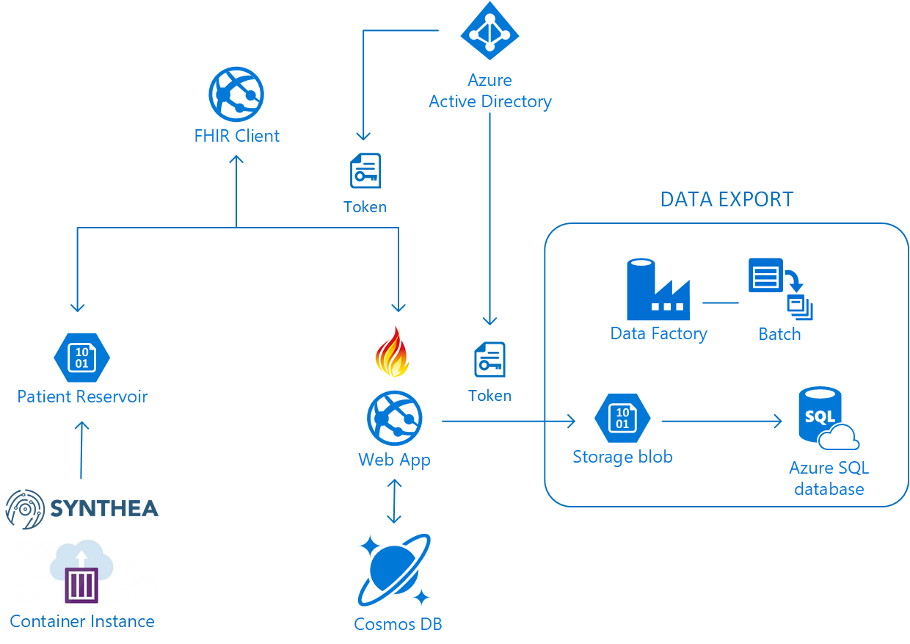

# FHIR in Azure Demo

This repository contains templates for deploying a [FHIR](https://hl7.org/fhir) demo in Azure. The demo environment contains a FHIR server, a simple web client for interacting with the server, and an Azure Data Factory export pipeline:




The demo can be deployed with PowerShell or using the Azure Portal.

## Prerequisites

The FHIR Server uses Azure Active Directory (AAD) for OAuth authentication. You need to register three (3) applications in Azure Active Directory:

1. An application registration for the FHIR API. This application will define the "AppRoles" that a user or application can have. 
2. A client application registration for use with the demo web client.
3. A service client application registration, which will be granted an AppRole to allow it to be used for automation using Data Factory.

You can create all three of these applications using the Azure Portal or you can use PowerShell. Since there are a few manual steps involved, PowerShell is recommended. You can use the [Azure Cloud Shell](https://azure.microsoft.com/en-us/features/cloud-shell/) from your browser if you don't have PowerShell on your machine (e.g., on Linux or Mac). 

This repository contains a [convenience script](PrepareFhirDemo.ps1) that you can use to set up AAD app registrations. You will need the `FhirServer` PowerShell module from the [Microsoft FHIR Server for Azure](https://github.com/Microsoft/fhir-server) and you should also close this repository to have the preparation script:

```PowerShell
git clone https://github.com/Microsoft/fhir-server
git clone https://github.com/hansenms/FhirDemo
Import-Module ./fhir-server/samples/scripts/PowerShell/FhirServer/FhirServer.psd1
```

Now prepare the environment:

```PowerShell
cd FhirDemo
$environmentParams = .\PrepareFhirDemo.ps1 -EnvironmentName <demoenvname>
```

The `$environmentParams` variable will contain the settings needed to deploy the environment:

```
Name                           Value
----                           -----
aadClientId                    a0d09b67-XXXX-XXXX-XXXX-5ce34fb78bb1aad
aadClientSecret                TTMCUfBXXXXXXXXXXXXXXXXXXXX3pxm9Jw2q5QwOXpc=
aadServiceClientId             12309b67-XXXX-XXXX-XXXX-5ce34fb78bb1234
aadServiceClientSecret         YYYYYYXXXXXXXXXXXXXXXXXXXXY3pxm9Jw2q5QwOXUU=
Audience                       https:/demoenvname.azurewebsites.net
environmentName                demoenvname
aadAuthority                   https://login.microsoftonline.com/0b471a55-XXXX-XXXX-XXXX-6c9b756101c3
```

You can store the environment details with:

```PowerShell
ConvertTo-Json $environmentParams | Out-File -FilePath .\environment.json
```

You can also restore the parameters from the file with something like:

```PowerShell
$environmentParams = (Get-Content .\environment.json | ConvertFrom-Json)
```

## Deployment

```PowerShell
rg = New-AzureRmResourceGroup -Name $environmentParams.environmentName -Location westus2

New-AzureRmResourceGroupDeployment -TemplateFile .\azuredeploy.json -TemplateParameterObject $environmentParams -ResourceGroupName $rg.ResourceGroupName
```

Or use the button below:

<a href="https://transmogrify.azurewebsites.net/azuredeploy.json" target="_blank">
    
</a>

## Clean Up

Delete the Resource Group:

```PowerShell
Remove-AzureRmResourceGroup -Name $rg.ResourceGroupName
```

Remove AAD Application Registrations

```PowerShell
 .\DeleteEnvironmentAppRegistrations.ps1 -EnvironmentName $environmentParams.environmentName
```